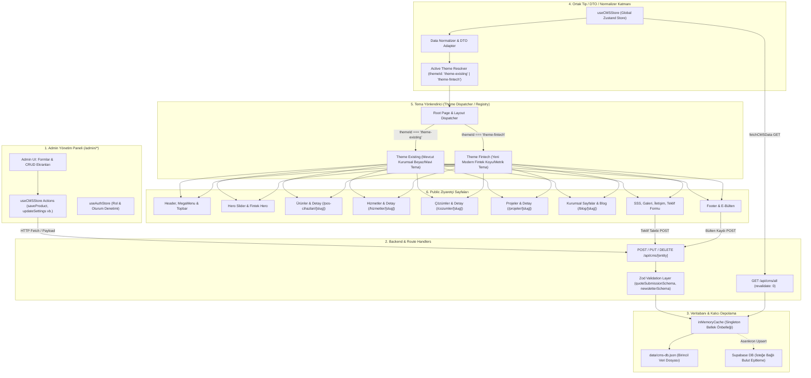

# PAYPOS / ONPOS2 — Veri Akışı ve Mimari Haritası (Aşama 1)

Bu doküman, tek admin paneli, tek veritabanı ve çift tema (`theme-existing` ve `theme-fintech`) mimarisinin uçtan uca veri akışını gösterir.

---

## 1. Ana Mimari Veri Akış Şeması

---

## 2. Veri Yaşam Döngüsü (Data Lifecycle) Adımları

### A. Okuma (Read / Hydration) Döngüsü
1. Kullanıcı siteye girdiğinde `src/app/layout.tsx` içindeki `<CMSHydrator />` çalışır.
2. `useCMSStore.getState().fetchCMSData()` tetiklenir.
3. `GET /api/cms/all` isteği `src/lib/cms-db.ts` üzerindeki bellek içi `inMemoryCache`'den veya `data/cms-db.json`'dan anında döner.
4. Gelen veriler `useCMSStore` içerisine yerleşir.
5. `CMSHydrator`, `settings.primaryColor`, `settings.accentColor`, `settings.layoutDensity` ve `settings.cardStyle` değerlerini CSS kök değişkenleri (`:root`) olarak DOM'a enjekte eder.
6. Tema seçicisi (`themeId`), gelen ayara göre (`'theme-existing'` veya `'theme-fintech'`) ilgili tema bileşen ağacını render eder.

### B. Yazma ve Güncelleme (Write / Mutation) Döngüsü
1. Yönetici `/admin/settings`, `/admin/products` vb. ekranından bir değişiklik yapıp "Kaydet"e basar.
2. `useCMSStore` ilgili eylemi (`saveProduct`, `updateSettings` vb.) çalıştırır.
3. `PUT` veya `POST` ile `/api/cms/[entity]` çağrılır.
4. `writeCMSData` fonksiyonu hem belleği hem de `data/cms-db.json` dosyasını günceller.
5. Sunucu yanıtı (200 OK) store'a döner, store local state'i anında güncellenir (reaktif güncelleme).
6. Sekme yenilense dahi dosya diskte kalıcı olduğu için tüm değişiklikler korunur.

### C. Teklif Formu İletim Döngüsü (Lead Submission Flow)
1. Ziyaretçi `QuoteModal` veya `QuoteFormSection` üzerinden formu doldurur.
2. `POST /api/cms/quote-submit` çağrılır.
3. Sunucuda `quoteSubmissionSchema` (Zod) ile ad-soyad, telefon, e-posta ve KVKK onayı doğrulanır.
4. Yeni başvuru kaydı `submissions` dizisinin başına eklenir ve kaydedilir.
5. Admin `/admin/submissions` sayfasına girdiğinde başvuru listesinde anında "Yeni" rozetiyle görünür.
