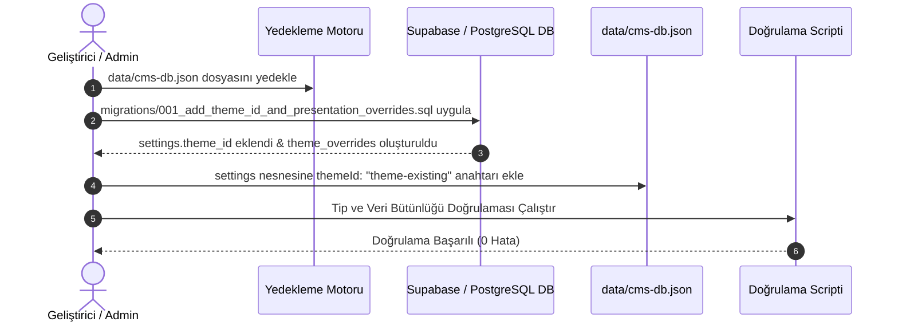

# PAYPOS / ONPOS2 — Veritabanı Migration Planı (MIGRATION_PLAN.md) (Aşama 3)

Bu doküman, çift tema mimarisi için hazırlanan migration adımlarını, çalıştırma prosedürünü, güvenlik kontrollerini ve doğrulama yöntemlerini tanımlar.

---

## 1. Migration Ön Koşulları ve Güvenlik Protokolü

> [!CAUTION]
> **ÖNEMLİ KURAL:** Bu migration kullanıcının açık onayı alınmadan **kesinlikle çalıştırılmayacaktır**.

1. **Yedekleme:**
   Migration öncesinde `data/cms-db.json` dosyasının bir anlık görüntüsü (`data/cms-db.backup-[timestamp].json`) alınacaktır.
2. **Ortam Ayrımı:**
   Doğrudan canlı üretim veritabanı yerine önce yerel ortam ve test veritabanında çalıştırılacaktır.
3. **Transaction Güvencesi:**
   SQL migration'ı `BEGIN` ve `COMMIT` blokları arasında çalıştırılır; herhangi bir hata durumunda otomatik rollback gerçekleşir.

---

## 2. Migration Adımları (Execution Sequence)



### Adım 1: Dosya ve Veri Tabanı Yedeği Alma
```bash
cp data/cms-db.json data/cms-db.backup-pre-migration.json
```

### Adım 2: SQL Migration'ının Uygulanması (Onaydan Sonra)
Dosya: `migrations/001_add_theme_id_and_presentation_overrides.sql`
- `settings` tablosuna `theme_id TEXT NOT NULL DEFAULT 'theme-existing'` eklenir.
- `theme_overrides` tablosu ve RLS politikaları oluşturulur.

### Adım 3: JSON Veritabanının Senkronizasyonu
`src/lib/default-data.ts` ve `data/cms-db.json` içinde `settings.themeId = 'theme-existing'` tanımlanır.

### Adım 4: TypeScript Tip ve DTO Senkronizasyonu
`src/types/index.ts` içinde `SiteSettings` arayüzüne `themeId: 'theme-existing' | 'theme-fintech'` alanı eklenir.

---

## 3. Doğrulama ve Kabul Kriterleri

1. `GET /api/cms/settings` çağrıldığında dönen JSON içinde `"themeId": "theme-existing"` yer almalıdır.
2. `GET /api/cms/all` çağrısı hatasız (200 OK) dönmelidir.
3. `themeId` değeri `'theme-fintech'` olarak güncellendiğinde `data/cms-db.json` ve bellekteki değer anında güncellenmelidir.
4. `npx tsc --noEmit` ve `npm run build` hatasız tamamlanmalıdır.
