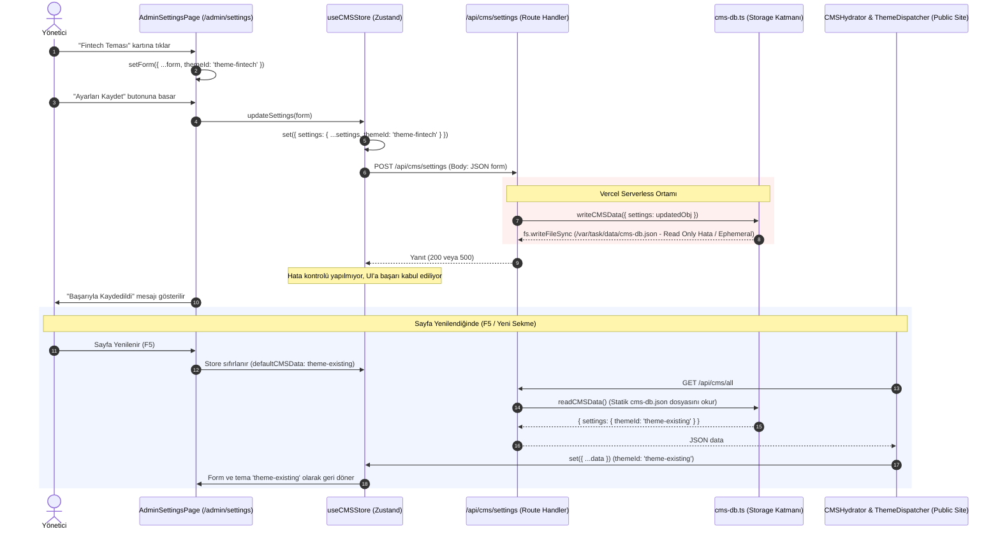

# THEME_REQUEST_RESPONSE_TRACE — İstek & Yanıt Akış Takip Raporu

**Tarih:** 2026-08-28  
**İncelenen Akış:** Tema Seçimi, Kayıt İsteği, Backend İşleme, Yanıt ve Sayfa Yenileme

---

## 1. İstek / Yanıt Sözleşmesi ve Yaşam Döngüsü



---

## 2. İstek ve Yanıt Detayları

### 1. UI Katmanı (`AdminSettingsPage.tsx`)
- **Tetikleyici:** `handleSubmit(e)`
- **Gönderilen Parametre:** `form` nesnesi
- **İçerik:** `{ ...settings, themeId: 'theme-fintech', ... }`

### 2. State & HTTP İstemcisi (`cms-store.ts`)
- **HTTP Metodu:** `POST`
- **Hedef URL:** `/api/cms/settings`
- **Headers:** `Content-Type: application/json`
- **Body:** `JSON.stringify(newSettings)` (Stringified form objesi)

### 3. Backend Route Handler (`src/app/api/cms/[entity]/route.ts`)
- **Yakalanan Parametre:** `entity = 'settings'`
- **Okunan Body:** `const body = await req.json();`
- **İşlem:**
  ```ts
  const currentEntityVal = (currentData as unknown as Record<string, unknown>)[entity];
  if (typeof currentEntityVal === 'object' && currentEntityVal !== null) {
    const objKey = entity as keyof CMSData;
    const updatedObj = { ...currentEntityVal, ...body };
    const newCMS = writeCMSData({ [objKey]: updatedObj });
    return NextResponse.json(newCMS[objKey], { status: 200 });
  }
  ```

### 4. Yeniden Okuma Akışı (`fetchCMSData`)
- **HTTP Metodu:** `GET`
- **Hedef URL:** `/api/cms/all`
- **Dönen Değer:** `readCMSData()` çıktısı
- **Hata Noktası:** Sunucu dosya sistemi kalıcı olmadığından `GET /api/cms/all` her zaman build zamanındaki statik `data/cms-db.json` içeriğini (`theme-existing`) döndürmektedir.
